<div align="center">

  <!-- Cyber Animated Terminal Header -->
  

  

  <!-- Quick Socials / Matrix Links -->
  <p align="center">
    <a href="https://linkedin.com/in/dian-rhmdni">
      
    </a>
    <a href="https://x.com/madiajijah11">
      
    </a>
    <a href="https://reddit.com/user/madiajijah11">
      
    </a>
    <a href="mailto:madiajijah7@gmail.com">
      
    </a>
  </p>

</div>

---

### 📡 `SYSTEM_TELEMETRY // ABOUT`

```bash
[+] USER        : Dian Rahmadani (@madiajijah11)
[+] SYSTEM_DESC : Passionate Full Stack Developer & Distributed Systems Enthusiast
[+] SPECIALTY   : Web Applications, Microservices & Web3 Integration
[+] LOCATION    : Indonesia 🇮🇩
[+] PGP_PING    : madiajijah7@gmail.com
```


### 🛠️ `ARSENAL // TECH STACK`

#### ⚡ Core Languages & Runtimes
<p align="left">
  
  
  
  
  
  
  
  
  
</p>

#### 🌐 Web & Frameworks
<p align="left">
  
  
  
  
</p>

#### ☁️ Cloud & Systems
<p align="left">
  
  
  
  
</p>


### 📊 `DATA_METRICS // GITHUB INTELLIGENCE`

<div align="center">
  <a href="https://github.com/madiajijah11">
    
  </a>
  <a href="https://github.com/madiajijah11">
    
  </a>
  <br/>
  <a href="https://github.com/madiajijah11">
    
  </a>
</div>
<br/>
<div align="center">
  
  <br/><br/>
</div>


### ⚡ `DECENTRALIZED_VAULT // CRYPTO TRANSMISSION`

<div align="center">
  <p>Fuel open-source engineering &amp; decentralized experiments:</p>
  <p>
    
    &nbsp;
    
    &nbsp;
    
    &nbsp;
    
  </p>
</div>

```yaml
BTC : bc1q3aej7x9wlvl54syt4qm48xcdn6zqa64cm6dwj6
ETH : 0xae69f5bcf7762bb5fe34d3832fd7d1954054674b
SOL : 6Et2XmHSdAD4QBR9Apdt9AVeJ77ktr1piV49q7RD4SLk
KAS : kaspa:qypgw7xw60yvxv5pcjncdv4f30wanju0g64hw3204wreayajt3025qgde344ycq
```

<div align="center">
  <br/>
  <a href="https://visitcount.itsvg.in">
    
  </a>
</div>
